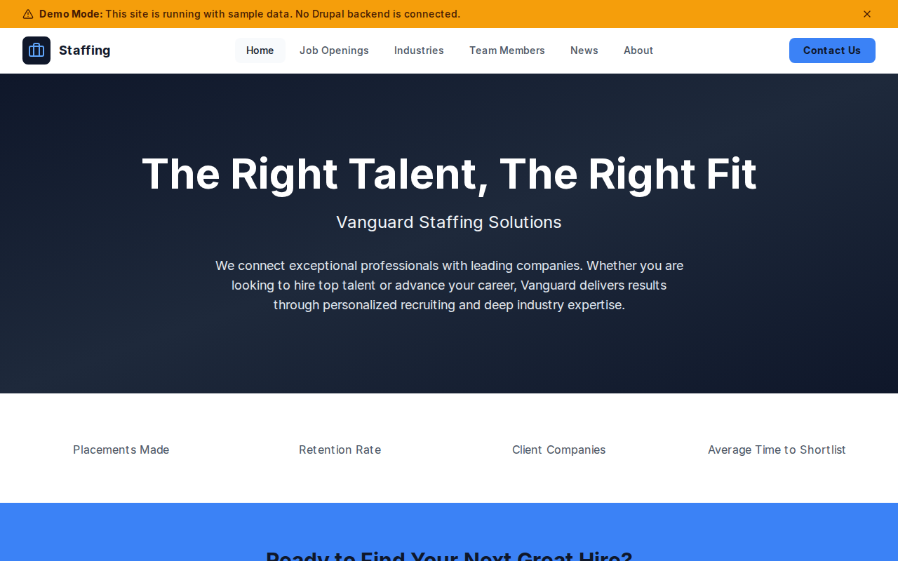

# Decoupled Staffing

A staffing and recruiting agency website starter built with Decoupled Drupal and Next.js. Designed for staffing firms, recruiting agencies, and talent acquisition companies that need to showcase job openings, industry expertise, and their team of recruiters.



## Features

- **Job Openings** - Current positions with company, location, salary range, employment type, and industry
- **Industry Specializations** - Staffing verticals with open position counts and detailed service descriptions
- **Recruiter Profiles** - Team member pages with specialty areas, contact info, and professional bios
- **News & Insights** - Hiring trends, career advice, and HR strategy articles
- **Homepage** - Hero section, placement statistics, featured opportunities, and call-to-action
- **Static Pages** - About, contact, and informational pages

## Quick Start

### 1. Clone the template

```bash
npx degit nextagencyio/decoupled-staffing my-staffing-agency
cd my-staffing-agency
npm install
```

### 2. Run interactive setup

```bash
npm run setup
```

This interactive script will:
- Authenticate with Decoupled.io (opens browser)
- Create a new Drupal space
- Wait for provisioning (~90 seconds)
- Configure your `.env.local` file
- Import sample content

### 3. Start development

```bash
npm run dev
```

Visit [http://localhost:3000](http://localhost:3000)

---

## Manual Setup

If you prefer to run each step manually:

<details>
<summary>Click to expand manual setup steps</summary>

### Authenticate with Decoupled.io

```bash
npx decoupled-cli@latest auth login
```

### Create a Drupal space

```bash
npx decoupled-cli@latest spaces create "My Staffing Agency"
```

Note the space ID returned (e.g., `Space ID: 1234`). Wait ~90 seconds for provisioning.

### Configure environment

```bash
npx decoupled-cli@latest spaces env 1234 --write .env.local
```

### Import content

```bash
npm run setup-content
```

This imports:
- Homepage with placement statistics and CTAs
- 4 Job Openings (Senior Software Engineer, Marketing Director, Financial Controller, Construction Project Manager)
- 3 Industry Specializations (Technology, Healthcare, Finance & Accounting)
- 3 Team Members (Karen Mitchell, Ryan O'Connor, Diana Flores)
- 3 News Articles (hiring trends, resume tips, retention strategies)
- 2 Static Pages (About, Contact)

</details>

## Content Types

### Job Opening
- Title, Body
- Company Name
- Location
- Employment Type (Full-Time, Part-Time, Contract)
- Salary Range
- Industry
- Featured Image

### Industry
- Title, Body
- Open Positions count
- Featured Image

### Team Member
- Title (name), Body (bio)
- Position / Role
- Email, Phone
- Specialty Area
- Photo

### News
- Title, Body
- News Category
- Featured Image

### Basic Page
- Title, Body

## Customization

### Colors & Branding
Edit `tailwind.config.js` to customize colors, fonts, and spacing. The default theme uses slate and blue tones for a professional, corporate look.

### Content Structure
Modify `data/staffing-content.json` to add or change content types and sample content.

### Components
React components are in `app/components/`. Update them to match your agency's branding.

## Demo Mode

Demo mode allows you to showcase the application without connecting to a Drupal backend. It displays mock content for the homepage, job openings, industries, team, and news.

### Enable Demo Mode

Set the environment variable:

```bash
NEXT_PUBLIC_DEMO_MODE=true
```

Or add to `.env.local`:
```
NEXT_PUBLIC_DEMO_MODE=true
```

### What Demo Mode Does

- Shows a "Demo Mode" banner at the top of the page
- Returns mock data for all GraphQL queries
- Displays sample job openings, industries, team members, and news
- No Drupal backend required

### Removing Demo Mode

To convert to a production app with real data:

1. Delete `lib/demo-mode.ts`
2. Delete `data/mock/` directory
3. Delete `app/components/DemoModeBanner.tsx`
4. Remove `DemoModeBanner` from `app/layout.tsx`
5. Remove demo mode checks from `app/api/graphql/route.ts`

## Deployment

### Vercel (Recommended)
[](https://vercel.com/new/clone?repository-url=https://github.com/nextagencyio/decoupled-staffing)

Set `NEXT_PUBLIC_DEMO_MODE=true` in Vercel environment variables for a demo deployment.

### Other Platforms
Works with any Node.js hosting platform that supports Next.js.

## Documentation

- [Decoupled.io Docs](https://www.decoupled.io/docs)
- [Next.js Documentation](https://nextjs.org/docs)
- [Drupal GraphQL](https://www.decoupled.io/docs/graphql)

## License

MIT
